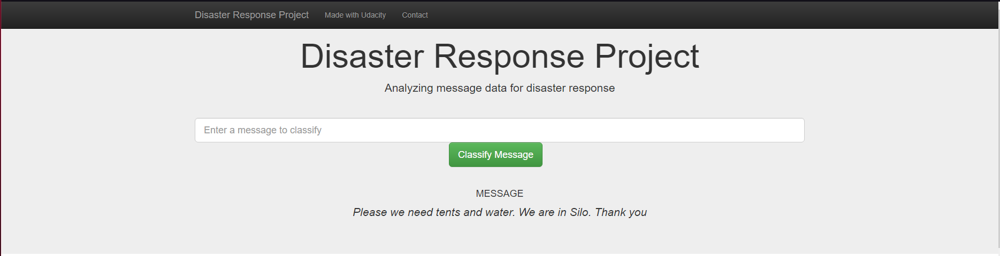
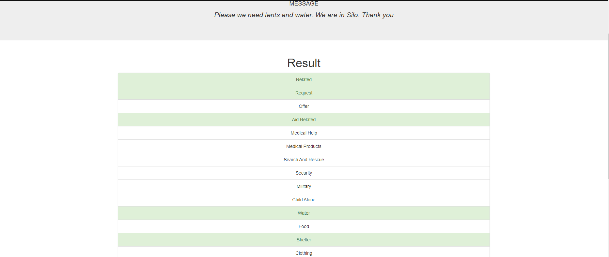

# Data Science Nanodegree
## Disaster Response Pipeline
### A Figure 8 dataset

### Table of Contents
1. [Introduction](#introduction)
2. [Dependencies](#libraries)
3. [ETL Pipeline](#ETL)
4. [ML Pipeline](#ML)
5. [Installation](#install)
6. [Executing Program](#execution)
7. [Licensing, Authors, and Acknowledgements](#licensing)
8. [Screenshots](#screenshots)

## 1. Introduction <a name="introduction"></a>
This Project is part of [Udacity's](https://www.udacity.com/) Data Science Nanodegree Program in collaboration with Figure Eight. The dataset contains pre-labelled messages from real-life disaster events. The project involves building a Natural Language Processing (NLP) model to categorize messages on a real time basis.

## 2. Dependencies <a name="libraries"></a>
* Python 3.6
* ETL: `pandas`, `numpy`, `seaborn`, `matplotlib`, `sqlalchemy`
* Machine Learning: ETL Libraries, `re` (regex), `scikit-learn`
* Natural Language Processing: `nltk`
* Model Loading and Saving: Pickle
* Model Deployment: Flask

#### 3. ETL Pipeline <a name="ETL"></a>

File _data/process_data.py_ contains data cleaning pipeline that:

- Loads the `messages` and `categories` dataset
- Merges the two datasets
- Cleans the data
- Stores it in a **SQLite database**

#### 4. ML Pipeline <a name="ML"></a>

File _models/train_classifier.py_ contains machine learning pipeline that:

- Loads data from the **SQLite database**
- Splits the data into training and testing sets
- Builds a text processing and machine learning pipeline
- Trains and tunes a model using GridSearchCV
- Outputs result on the test set
- Exports the final model as a pickle file

## 5. Installation <a name="install"></a>
To clone the reponsitory:
```
git clone https://github.com/Lawbin/Disaster-Response-Pipeline.git
```

#### 6. Executing Program <a name="execution"></a>

1. You can run the following commands in the project's directory to set up the database, train model and save the model.

    - To run the ETL pipeline to clean data and store the processed data in the database
        `python data/process_data.py data/disaster_messages.csv data/disaster_categories.csv data/disaster_response_db.db`
    - To run the ML pipeline that loads data from DB, trains classifier and saves the classifier as a pickle file
        `python models/train_classifier.py data/disaster_response_db.db models/classifier.pkl`

2. Run the following command in the app's directory to run your web app.
    `python run.py`

Notebooks
**ETL Pipeline Preparation.ipynb** - jupyter notebook to learn about the implemented ETL pipeline.
**ML Pipeline Preparation** - jupyter notebook for the machine learning pipeline developed using libraries, `nltk` and `scikit-learn`.

## 7. Licensing, Authors, Acknowledgements<a name="licensing"></a>
* [Udacity](https://www.udacity.com/) for providing an amazing Data Science Nanodegree Program.
* [Figure Eight](https://www.figure-eight.com/) for providing the relevant dataset to train the model.

## 8. Screenshots <a name="screenshots"></a>

1. This is an example of a message we can type to test the performance of the model



2. After clicking **Classify Message**, we can see the categories which the message belongs to highlighted in green



3. The main page shows some graphs about training dataset, provided by Figure Eight
